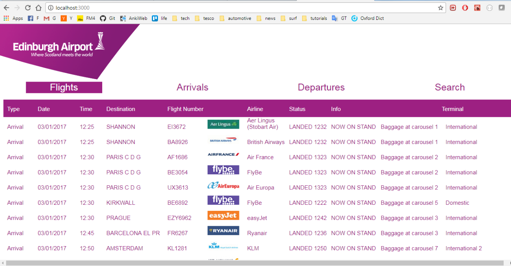
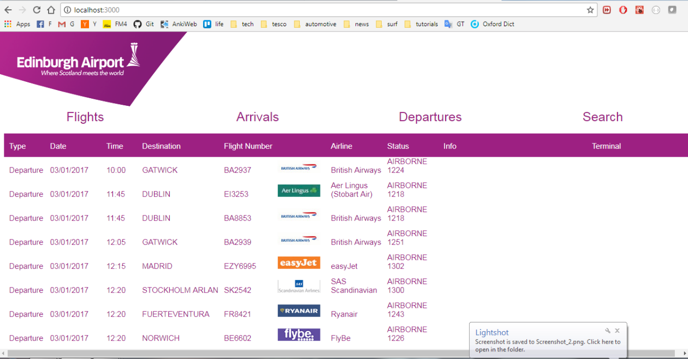
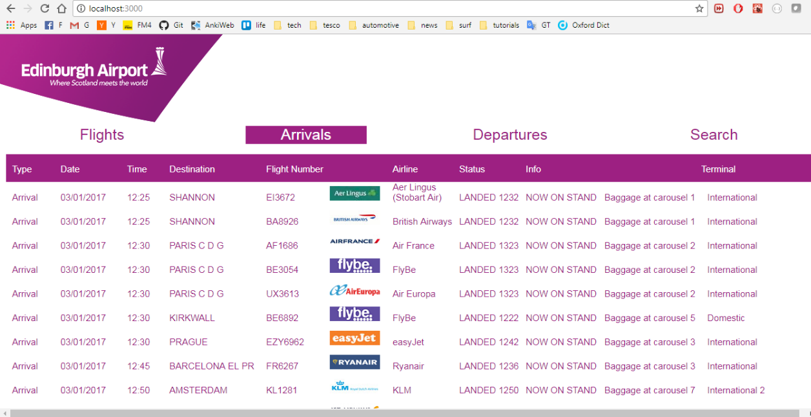
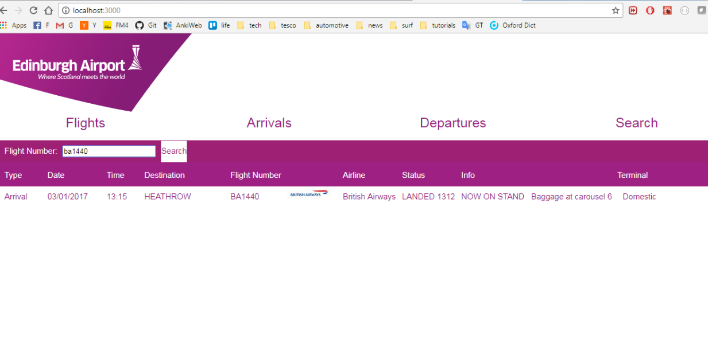

# AirportAPI
Single page app in ES6/React to search through flights JSON file and retrieve arrivals, departures and particular flights

## To run:
1.  Download or clone the repository.
2.  Install dependencies in top level folder by running *npm install*
3.  Install dependencies in client folder the same way as in step 2.
4.  Run *npm start* in top level folder.
5.  Run *npm start* in client folder.
6.  In web browser go to *localhost:3000* for React app.
7.  In web browser go to *localhost:3000/flights/...* for API routes.

## Screenshots

